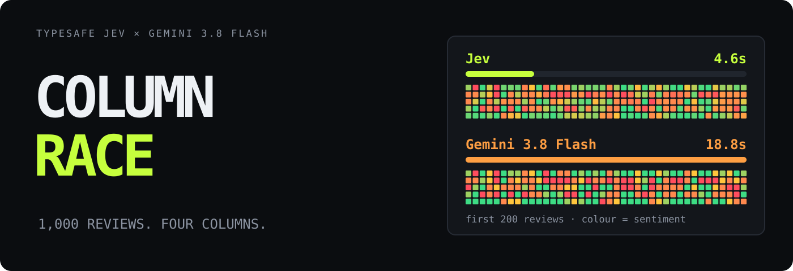
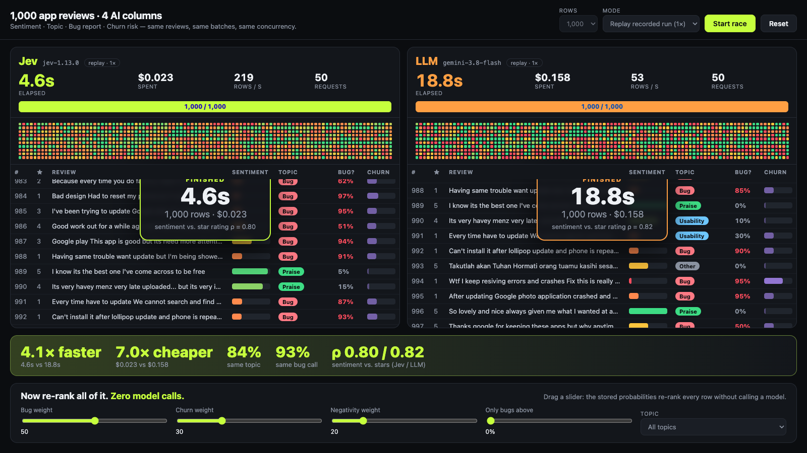
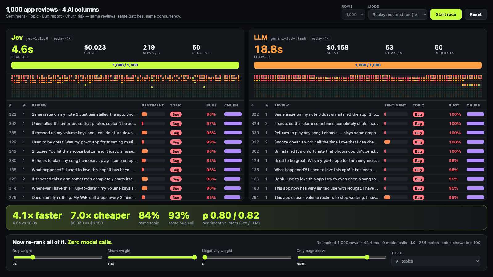

# Jev Column Race 🏁

**Four AI columns over 1,000 real app reviews, raced live: TypeSafe's Jev against Gemini 3.8 Flash.**

Both lanes get the same reviews, the same batches, and the same concurrency. [Jev](https://docs.typesafe.ai) answers 80 typed questions per request. Gemini returns one JSON object per request.

**Jev labelled all 1,000 reviews in 4.6 seconds for $0.023. Gemini 3.8 Flash took 18.8 seconds and $0.158.** That is 4.1× faster and 7.0× cheaper in one recorded run pair, with star-rating agreement of ρ 0.80 vs 0.82.



[Measurements](docs/performance.md) · [Design](docs/design.md) · [Read the questions](lib/columns.mjs)

## The columns

| Column | Jev question | Gemini output |
| --- | --- | --- |
| Sentiment | Score, 5 described levels | integer 0–4 |
| Topic | Choice: bug, pricing, usability, feature request, praise, other | one label |
| Bug report | Noul (probability) | number 0–1 |
| Churn risk | Score, 4 described levels | integer 0–3 |

The reviews are 1,000 Android app reviews from Hugging Face [`sealuzh/app_reviews`](https://huggingface.co/datasets/sealuzh/app_reviews), across 17 apps. Star ratings are never sent to either model. They are the independent check on sentiment.

```text
                 data/reviews.json · 1,000 reviews, stars withheld
                                   │
                  20 reviews per request · 8 in flight · 50 requests
                 ┌─────────────────┴─────────────────┐
                 ▼                                   ▼
        Jev lane (TypeSafe)                 Gemini lane (OpenAI-compatible)
        80 typed questions                  one JSON object, 20 results
        score · choice · noul               reasoning_effort: "none"
                 │                                   │ invalid JSON → retry, counted
                 ▼                                   ▼
             validate                        parse → validate
                 └───────────► rows events ◄─────────┘
                                   │
                   browser: timers, cost, heat map, table
                   runs/<side>.json: recorded for replay
```

## Try it

```bash
git clone https://github.com/goodrahstar/jev-column-race.git
cd jev-column-race
cp .env.example .env
# Add TYPESAFE_API_KEY, and LLM_API_KEY for the Gemini lane.
node server.mjs
```

Open **http://127.0.0.1:8777** and click **Start race**. There is nothing to install: zero npm dependencies, Node 20 or newer.

- **Live API calls** runs both lanes for real and saves each finished run to `runs/<side>.json`. This costs money.
- **Replay recorded run (1×)** re-emits a recorded run on its original timestamps. The lane is labelled "replay · 1×". Replays need no keys and are never sped up. Use them for free retakes.
- `?mode=replay&autostart` starts a replay on load. Portrait windows stack the lanes for vertical video.

The right lane takes any OpenAI-compatible endpoint. Set `LLM_BASE_URL`, `LLM_MODEL`, `LLM_LABEL`, and the per-million token prices in `.env`. The defaults in `.env.example` are the settings used for the recorded run.

## How it works

- **Same work for both lanes.** The server splits the reviews into batches of 20 and runs 8 requests at a time until all 50 are done. The clock starts before the first request and stops when the last batch is parsed.
- **Jev: one request, 80 questions.** Each review gets four independent questions over the shared batch. Answers come back typed: a score, a choice, or a Noul probability.
- **Gemini: one prompt, one JSON object.** The same level descriptions and topic definitions go into a system prompt. JSON mode is on and thinking is off (`reasoning_effort: "none"`), its fastest and cheapest setting. 3.8 Flash rejects `"minimal"`.
- **Every row is validated.** Invalid Gemini JSON or a missing row retries the whole batch, and the retry counts toward requests and cost. The recorded run needed none.
- **Keys stay on the server.** The browser receives rows, totals, and model names. A check asserts that no page, API response, or replay stream contains the TypeSafe key.

## Why it's fast

- **Per-request latency decides the race.** Both lanes send 50 requests at concurrency 8. Jev's median request took **528 ms**; Gemini's took **2,353 ms**. When Jev finished, Gemini had 200 of 1,000 rows.
- **A short tail.** Jev's slowest request was 1,516 ms. Gemini's was 8,256 ms, and seven of its requests took over 4 s.
- **Cheap input, free output.** Jev costs $0.042 per million input tokens, and output tokens are free. Gemini costs $0.75 per million input and $3.75 per million output. $0.109 of Gemini's $0.158 is output tokens.

## Re-rank without a model



After the race, sliders re-rank every row from the stored answers. There are **zero model calls**. In headless Chrome, each slider update took **36–109 ms** in one check, including sort, filter, DOM reorder, and layout. The check fails above 150 ms.

Jev's answers give finer rankings because they rarely tie. Across 1,000 rows Jev returned **204 distinct churn values** against Gemini's 4, and 95 distinct bug probabilities against 19. With the default weights, Jev's priority score has 673 distinct values and its largest tie is 11 rows. Gemini's has 44, with 299 rows tied at one value.

## Small enough to read

| File | Job |
| --- | --- |
| [lib/columns.mjs](lib/columns.mjs) | The four columns: Jev questions, Gemini prompt, answer validation |
| [lib/racers.mjs](lib/racers.mjs) | Batching, concurrency, retries, token and cost accounting |
| [server.mjs](server.mjs) | Zero-dependency server, key handling, event stream, replay, run recording |
| [public/app.js](public/app.js) | Lanes, timers, verdict, re-rank |
| [scripts/fetch-data.mjs](scripts/fetch-data.mjs) | Regenerates `data/reviews.json` from Hugging Face |
| [scripts/](scripts) | Offline checks |

## Evidence and limits

The recorded pair is `runs/jev.json` and `runs/llm.json`. Both lanes started in the same browser tick, from one machine over the public internet. Jev (`jev-1.13.0`) finished in **4,576 ms** using 536,872 input tokens, costing **$0.0225**. Gemini 3.8 Flash finished in **18,781 ms** using 64,489 input and 29,126 output tokens, costing **$0.1576** at standard paid-tier prices valid through 2026-12-31. Neither lane needed a JSON retry.

On quality the two are close, and Gemini is marginally better. Sentiment against star rating gives Spearman **ρ 0.803** for Jev and **0.822** for Gemini. The models pick the same topic for **84.4%** of reviews and make the same bug call (probability ≥ 0.5) for **92.6%**.

- **One task, one dataset, one run pair.** The network is live, and timings vary. An earlier pair measured 3.4 s vs 18.6 s.
- **Jev uses about 8× more input tokens**, because every question repeats its rubric. It is still about 7× cheaper.
- **Stars are a weak proxy for sentiment.** 72% of the reviews are 1 or 5 stars, so star ranks tie heavily.
- **Agreement is not accuracy.** No human labelled topics or bugs, so 84% and 93% measure how often the models agree, not who is right.
- **Your prices may differ.** Costs use list prices and reported token counts, not an invoice.

Measurement boundaries, cost math, and the full numbers are in [performance.md](docs/performance.md).

## Development

```bash
npm run check                       # all of the below, in order
node scripts/verify-data.mjs        # dataset: 1,000 reviews, 17 apps, provenance
node scripts/verify-server.mjs      # page and API work, no key in any response
node scripts/verify-run.mjs jev     # recorded run complete, cost matches tokens
node scripts/verify-run.mjs llm
node scripts/verify-quality.mjs     # sentiment vs stars
node scripts/verify-llm-mock.mjs    # Gemini lane against a local mock, bad JSON retried
node scripts/verify-replay.mjs      # replay keeps original timestamps
node scripts/verify-browser.mjs     # headless Chrome: race, verdict, re-rank speed, shots/
```

Checks make no paid API calls. `verify-server.mjs` needs a `TYPESAFE_API_KEY` in `.env` as a positive control for the leak detector; it never sends it anywhere. `verify-browser.mjs` needs Google Chrome (set `CHROME` if it is not in `/Applications`). Only a live race in the page calls TypeSafe or Gemini.

---

Inspired by [browser-use/jev-ultrafast](https://github.com/browser-use/jev-ultrafast) · [TypeSafe docs](https://docs.typesafe.ai) · [sealuzh/app_reviews](https://huggingface.co/datasets/sealuzh/app_reviews) · MIT
